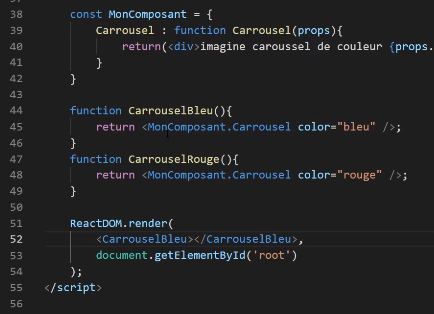
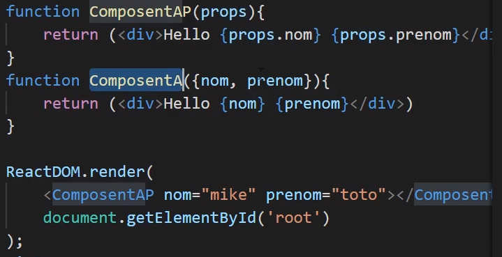

# JSX

**Avec JSX on peut créer nos propres balises html.On peut mettre ces balises dans des variables.**

```html
 const element = <h1>Hello</h1>;
    const element2 = <h1>Hello2</h1>;
    const x = 2;
    let affichage;

    function Compo(){
        if (x === 2) {
            affichage = element2;
        } else  {
            affichage = element;
        }
        return (
            <div>
                {affichage}
            </div>
        )
    }

    ReactDOM.render(
        <div> 
        <Compo/>
        </div>,
        document.getElementById("root")
    );
```



